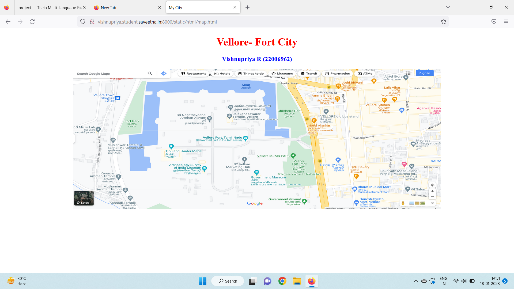
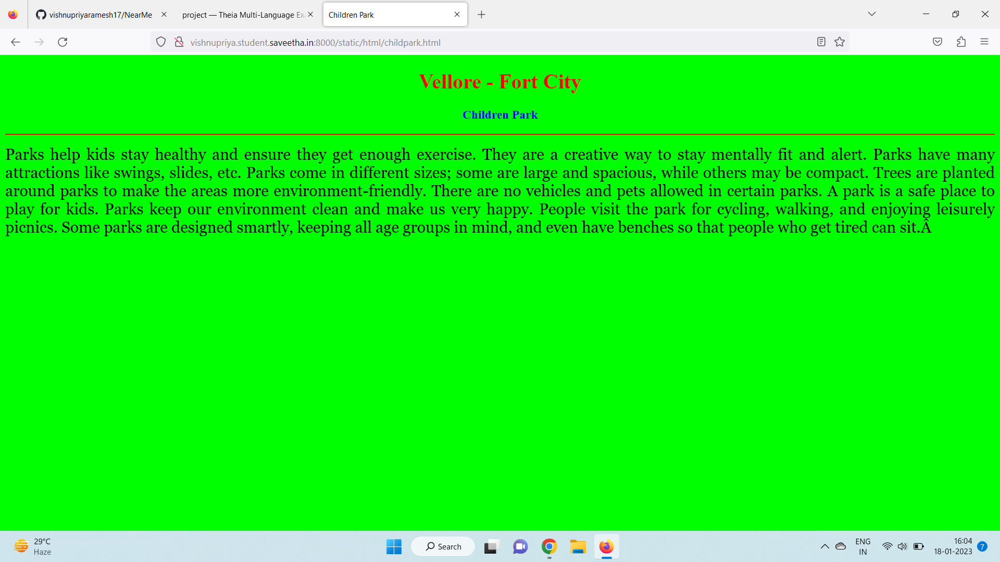
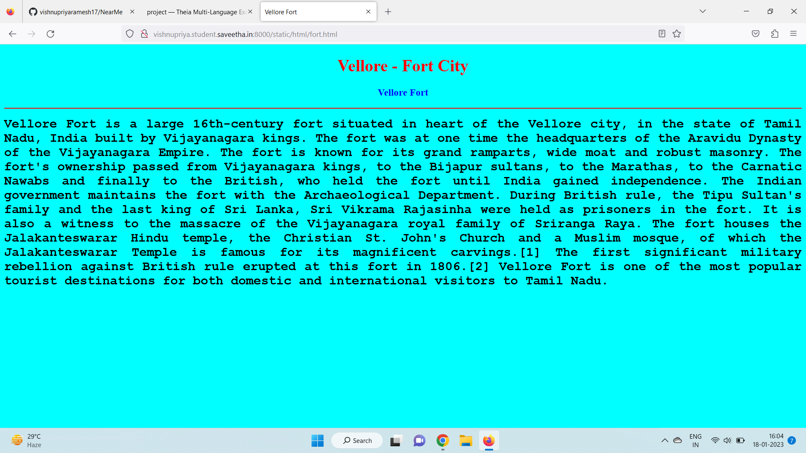
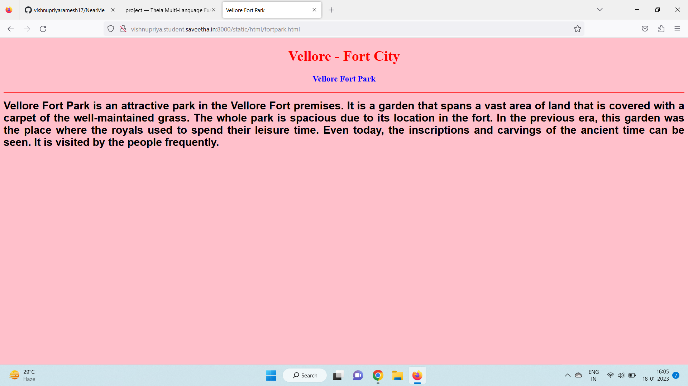
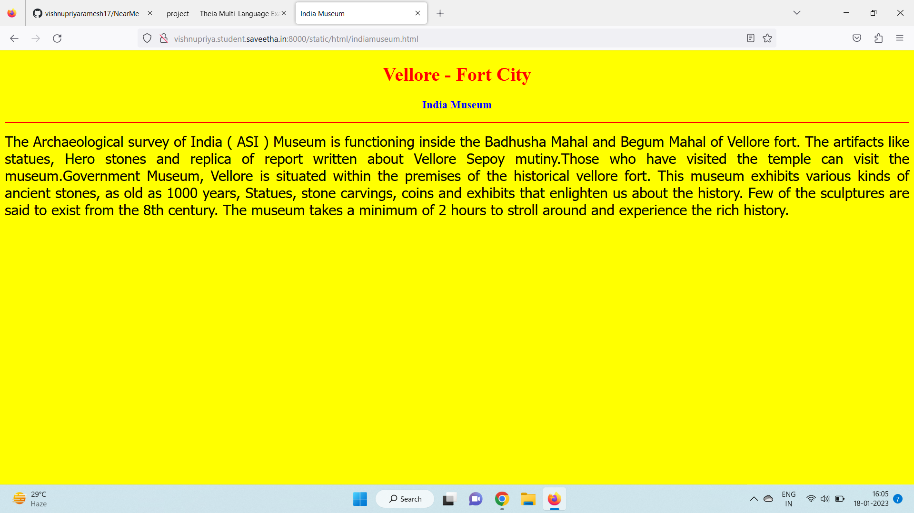
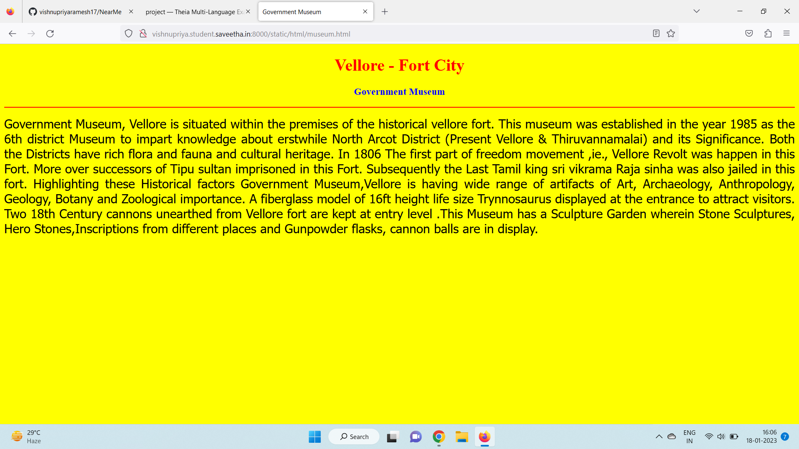
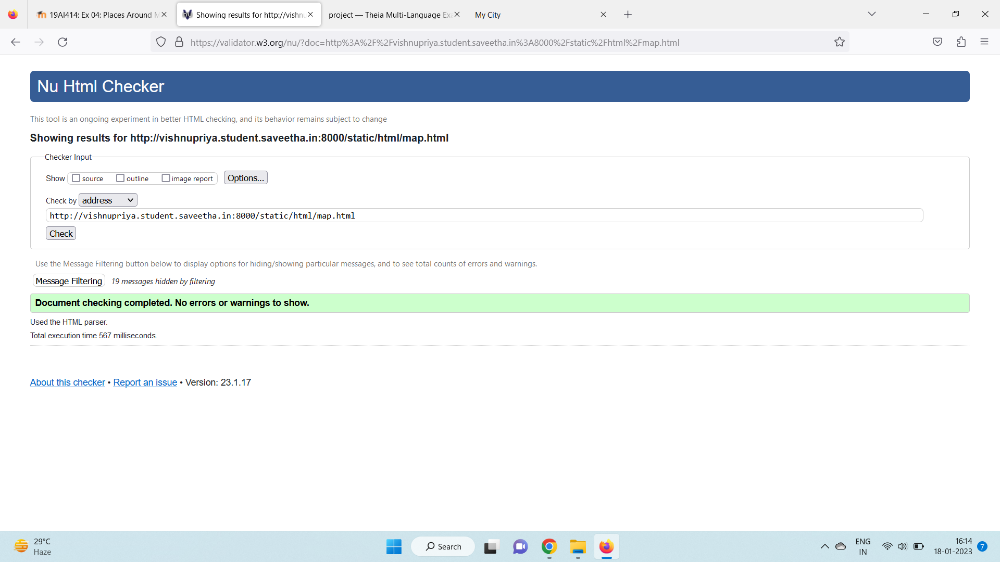

# Places Around Me
## AIM:
To develop a website to display details about the places around my house.

## Design Steps:

### Step 1:
Clone the github repository into Theia IDE.

### Step 2:
Create a new Django project.

### Step 3:
Write the needed HTML code.

### Step 4:
Run the Django server and execute the HTML files.

## Code:
```
map.html
<!DOCTYPE html>
<html lang="en">
<head>
<title>My City</title>
</head>
<body>
<h1 align="center">
<font color="red"><b>Vellore- Fort City</b></font>
</h1>
<h3 align="center">
<font color="blue"><b>Vishnupriya R (22006962)</b></font>
</h3>
<center>

<map name="MyCity">
<area shape="circle" coords="12.921219180618353, 79.12957867008" href="/static/html/fort.html" title="Vellore Fort">
<area shape="rectangle" coords="12.91966838683918, 79.12999929977518" href="/static/html/museum.html" title="Government Museum">
<area shape="circle" coords="12.920087280360919, 79.12795101604206" href="/static/html/indiamuseum.html" title="India Museum">
<area shape="circle" coords="12.919962503640681, 79.1316360979369" href="/static/html/fortpark.html" title="Vellore Fort Park">
<area shape="rectangle" coords="12.92229760050082, 79.13127947710838" href="/static/html/childpark.html" title="Children Park">
</map>
</center>
</body>
</html>

childpark.html
<!DOCTYPE html>
<html lang="en">
<head>
<title>Children Park</title>
</head>
<body bgcolor="lime">
<h1 align="center">
<font color="red"><b>Vellore - Fort City</b></font>
</h1>
<h3 align="center">
<font color="blue"><b>Children Park</b></font>
</h3>
<hr size="3" color="red">
<p align="justify">
<font face="Georgia" size="5">
Parks help kids stay healthy and ensure they get enough exercise.
They are a creative way to stay mentally fit and alert.
Parks have many attractions like swings, slides, etc.
Parks come in different sizes; some are large and spacious, while others may be compact.
Trees are planted around parks to make the areas more environment-friendly.
There are no vehicles and pets allowed in certain parks.
A park is a safe place to play for kids.
Parks keep our environment clean and make us very happy.
People visit the park for cycling, walking, and enjoying leisurely picnics.
Some parks are designed smartly, keeping all age groups in mind, and even have benches so that people who get tired can sit. 

</font>
</p>
</body>
</html>

fort.html
<!DOCTYPE html>
<html lang="en">
<head>
<title>Vellore Fort</title>
</head>
<body bgcolor="cyan">
<h1 align="center">
<font color="red"><b>Vellore - Fort City</b></font>
</h1>
<h3 align="center">
<font color="blue"><b>Vellore Fort</b></font>
</h3>
<hr size="3" color="red">
<p align="justify">
<font face="Courier New" size="5">
<b>
Vellore Fort is a large 16th-century fort situated in heart of the Vellore city, in the state of Tamil Nadu,
 India built by Vijayanagara kings. 
The fort was at one time the headquarters of the Aravidu Dynasty of the Vijayanagara Empire. 
The fort is known for its grand ramparts, wide moat and robust masonry.
The fort's ownership passed from Vijayanagara kings, to the Bijapur sultans, to the Marathas, to the Carnatic Nawabs
 and finally to the British, who held the fort until India gained independence. The Indian government maintains the 
 fort with the Archaeological Department. During British rule, the Tipu Sultan's family and the last king of Sri Lanka, 
 Sri Vikrama Rajasinha were held as prisoners in the fort. It is also a witness to the massacre of the Vijayanagara 
 royal family of Sriranga Raya. The fort houses the Jalakanteswarar Hindu temple, the Christian St. John's Church
  and a Muslim mosque, of which the Jalakanteswarar Temple is famous for its magnificent carvings.[1] The first 
  significant military rebellion against British rule erupted at this fort in 1806.[2]

Vellore Fort is one of the most popular tourist destinations for both domestic and international visitors to Tamil Nadu.


</b>
</font>
</p>
</body>
</html>

fortpark.html
<!DOCTYPE html>
<html lang="en">
<head>
<title>Vellore Fort Park</title>
</head>
<body bgcolor="pink">
<h1 align="center">
<font color="red"><b>Vellore - Fort City</b></font>
</h1>
<h3 align="center">
<font color="blue"><b>Vellore Fort Park</b></font>
</h3>
<hr size="3" color="red">
<p align="justify">
<font face="Arial" size="5">
<b>
Vellore Fort Park is an attractive park in the Vellore Fort premises. It is a garden that spans a vast area of land that is
 covered with a carpet of the well-maintained grass. The whole park is spacious due to its location in the fort. In the 
 previous era, this garden was the place where the royals used to spend their leisure time. Even today, the inscriptions
 and carvings of the ancient time can be seen. It is visited by the people frequently.
</b>
</font>
</p>
</body>
</html>

indiamuseum.html
<!DOCTYPE html>
<html lang="en">
<head>
<title>India Museum</title>
</head>
<body bgcolor="yellow">
<h1 align="center">
<font color="red"><b>Vellore - Fort City</b></font>
</h1>
<h3 align="center">
<font color="blue"><b>India Museum</b></font>
</h3>
<hr size="3" color="red">
<p align="justify">
<font face="Tahoma" size="5">
The Archaeological survey of India ( ASI ) Museum is functioning inside the Badhusha Mahal and Begum Mahal of Vellore fort.
 The artifacts like statues, Hero stones and replica of report written about Vellore Sepoy mutiny.Those who have visited the 
 temple can visit the museum.Government Museum, Vellore is situated within the premises of the historical vellore fort.
 This museum exhibits various kinds of ancient stones, as old as 1000 years, Statues, stone carvings, coins and exhibits that
  enlighten us about the history. Few of the sculptures are said to exist from the 8th century. The museum takes a minimum of
 2 hours to stroll around and experience the rich history.
</font>
</p>
</body>
</html>

museum.html
<!DOCTYPE html>
<html lang="en">
<head>
<title>Government Museum</title>
</head>
<body bgcolor="yellow">
<h1 align="center">
<font color="red"><b>Vellore - Fort City</b></font>
</h1>
<h3 align="center">
<font color="blue"><b>Government Museum</b></font>
</h3>
<hr size="3" color="red">
<p align="justify">
<font face="Tahoma" size="5">
Government Museum, Vellore is situated within the premises of the historical vellore fort. This museum was established
 in the year 1985 as the 6th district Museum to impart knowledge about erstwhile North Arcot District (Present Vellore &
  Thiruvannamalai) and its Significance. Both the Districts have rich flora and fauna and cultural heritage. In 1806 The
   first part of freedom movement ,ie., Vellore Revolt was happen in this Fort. More over successors of Tipu sultan 
   imprisoned in this Fort. Subsequently the Last Tamil king sri vikrama Raja sinha was also jailed in this fort.
    Highlighting these Historical factors Government Museum,Vellore is having wide range of artifacts of Art, Archaeology,
     Anthropology, Geology, Botany and Zoological importance.
A fiberglass model of 16ft height life size Trynnosaurus displayed at the entrance to attract visitors. Two 18th Century
 cannons unearthed from Vellore fort are kept at entry level .This Museum has a Sculpture Garden wherein Stone Sculptures,
  Hero Stones,Inscriptions from different places and Gunpowder flasks, cannon balls are in display.
</font>
</p>
</body>
</html>
```

## Output:












## HTML Validator


## Result:
The program for implementing image map is executed successfully